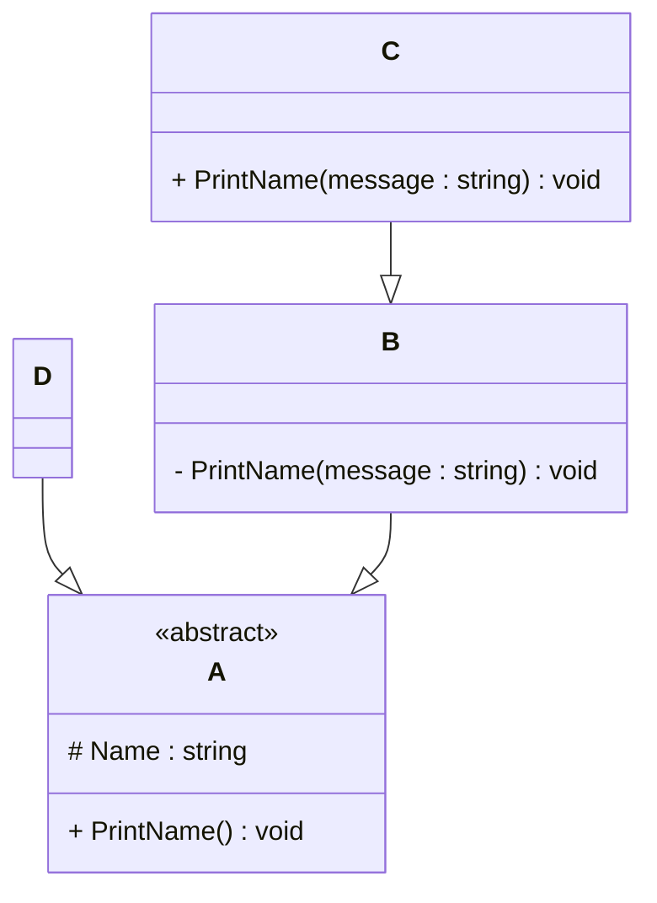

# Programming Test

This test was composed to create a general overview of your knowledge regarding general programming and how it fits with the needs in our lab. Please try to answer all questions using your own knowledge and in your own words. If you get stuck on one of the exercises, still try to give a short answer.

---

## Exercise 1

### Task
Write a program in the language of your choice where:

1. The iteration number (starting from 1), followed by a random number between 1 and 100, is printed 100 times.
2. After every 5 iterations, write an additional separator (e.g., `---`).
3. Write “Lucky number!” after every random number that is divisible by 7.

> Try to keep the procedure as short as possible.

--- namespace programming_test
{
    internal class Program
    {
        static void Main(string[] args)
        {
            Random random = new Random();
            

            for (int i = 1; i < 101; i++)
            {
                int randomNumber = random.Next(1, 101); // Generates Random Number on each iteration

                if (i % 5 == 0)
                {
                    Console.WriteLine("---"); // Prints the seperator after every 5 iterations
                }
                if (randomNumber % 7 == 0)
                {
                    Console.WriteLine(randomNumber + " " + "Lucky number!"); // Prints Lucky number if the number is divisible by 7
                }
                else
                {
                    Console.WriteLine(randomNumber);
                }
            }
        }
    }
}

## Exercise 2

### 1. **What is your understanding of the term “Design Patterns”?**  
   Provide a description in your own words.
   
       Design Patterns are used to make the application scalable without affecting esisting features.
       
### 2. **Explain the MVC Pattern**  
   - What does MVC stand for?  
   - Explain the pattern in detail.  
   - What are some use cases for this framework?

       MVC stands for Model, View, Controller. This pattern seperates the data and data manipulation/logic and user interface from each other. Model handles the data while controllers handle the user interaction and data logic, Views contain the user interface code. This framework is used to maintain the functionality and scalability of the product.
     

### 3. **List three other design patterns**  
   - Provide names and details for three additional design patterns.
   - Explain how you have used those patterns in the past and how they have solved your problem  
   - Use diagrams to explain the design patterns.

---  As per my experience I have only worked with Repository pattern where we change the direct connection of controllers to data and add a repository layer which contains all the functions so then controller access functions from this layer that has data access information internally. I used it to maintain the flexibity and scalabity of the application and it helped me to achieve that without any hurdles.

## Exercise 3

### 1. **Implementation Task**  
   Based on the class diagram below, provide an implementation in any object-oriented programming language of your choice.
   

namespace programming_test
{
    abstract class A
    {
        protected string Name = "Alex";
        public abstract void PrintName();
    }

    class B : A
    {  
        public void PrintName(string message)
        {
            Console.WriteLine("B says: " + message);
        }

         
        public override void PrintName()
        {
            Console.WriteLine($"Print {Name} from B (override of A)");
        }

    }

    class C : B
    {
        public void PrintName(string message)
        {
            Console.WriteLine(Name + " " + message);
        } 
    }

    class D : A 
    {
        public void PrintName(string message)
        {
            Console.WriteLine("D says: " + message);
        }

        public override void PrintName()
        {
            Console.WriteLine($"Print {Name} from D (override of A)");
        }
    }

    internal class Program
    {
        static void Main(string[] args)
        {

            B b = new B();
            b.PrintName("Hello World B");
            b.PrintName();

            C c = new C();
            c.PrintName("is a nice boy.");

            D d = new D();
            d.PrintName("Hello World D");
            d.PrintName();
             
        }
    }
}

### 2. **Key Questions**  
   - Are you able to directly create a new instance of `ObjectA`? Please explain your answer.  
   - Given an instance of `ObjectC`, are you able to call the method `PrintMessage` defined in `ObjectB`? Please explain your answer.  
   - Try to explain as many key features of object-oriented programming as you can find in this example.

--- No, Object for A can not be created because it is an abstract class which does not allow that.

    I am not able to call the method defined in Object B from C directly, even though C is inheriting the B but these are two different methods and instead of overriding the method hiding happening here.

    Let's start with abstraction, it let's us hide the important information and only allow to access that information through derivation just as we doing with class A which is abstract and it's method printName is only accessible through it's child classes. Then comes Encapsulation, Wrapping data and controlling access, just as we are doing here "protected string Name = "Alex";"  it's hidden from outside the class but accessible inside derived classes. Now let's discuss Inheritence, we can define something in one class and then use that information in other classes by interiting the class just like it is being done in our example. Next is Polymorphism , multiple shapes of an already defined method as in our example the manipulation of PrintName method using override.
    
## Exercise 4

### Maintaining and Expanding Software for Component Validation

This exercise focuses on strategies for working with existing code bases and ensuring the software remains maintainable as new features and requirements are introduced.

### 1. **Working with Existing Code**  
- How would you approach understanding and contributing to an existing code base with minimal disruption?  
- What practices would you follow to ensure your changes integrate well with the current structure?  

To understand an existing codebase, I trace requests from the frontend using browser tools or the console, then follow them through the controller and deeper layers like services or repositories. This helps me grasp the structure and logic. When integrating my changes, I follow existing patterns, reuse code where possible, and ensure consistency with the project’s architecture, testing carefully to avoid breaking existing functionality.

### 2. **Ensuring Maintainability**  
- What techniques would you use to keep the code base clean, modular, and easy to maintain as new features are added?  
- How would you handle code documentation and testing to support long-term maintainability?  

To keep the code easy to maintain, I follow the project's structure and try to write clean, organized code. I make sure that new features don’t break or affect existing ones. I read the documentation to understand how things work and test my changes using different scenarios and API endpoints to make sure everything works well.

### 3. **Balancing Flexibility and Stability**  
- How would you design or refactor the software to make it flexible for future changes while ensuring the existing functionality remains stable?  
- Which design patterns or principles would you apply to achieve this balance
---
I try to follow the ideas of Clean Architecture by organizing code in layers, such as separating logic into controllers, services, and repositories. This helps keep the code clean, readable, and easier to update in the future. It also reduces the risk of breaking existing features when adding new ones, and makes testing and debugging simpler.
